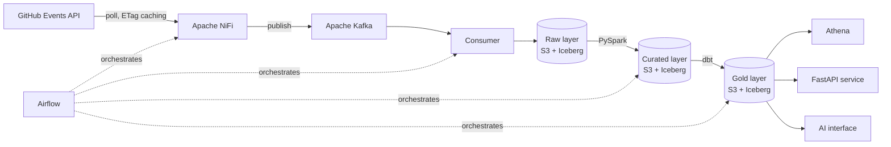

# GitPulse

A self-directed data platform project that ingests GitHub's public event stream and moves it through a full medallion architecture (raw → curated → gold), exposed via an API and an AI interface, and operated the way a production platform would be.

## Why this project exists

I'm Kim Littlejohn, a senior data engineer using time between roles deliberately: closing specific, named skills gaps rather than working through generic tutorials. Every phase of this project maps to a concrete requirement drawn from real job adverts I've applied against — see [`docs/adr/`](docs/adr/) for the reasoning behind each significant decision, and [`docs/phases/`](docs/phases/) for what was actually built, what broke, and what I'd do differently, phase by phase.

This is a personal learning project, built and documented in the open so the process — not just a finished result — is visible.

## Status

**Phase 0 — Foundations** (in progress). See [`docs/phases/phase-0-log.md`](docs/phases/phase-0-log.md) for the live working log.

## Planned architecture

Orchestration, deployment and governance layers not shown above: Terraform for infrastructure-as-code, GitHub Actions for CI (with OIDC federation to AWS — no long-lived keys), Kubernetes via `kind` locally and Argo CD for deployment, AWS Secrets Manager for runtime credentials, and monitoring/alerting/logging wired to data-quality and volume checks. Full reasoning for each choice is in [`docs/adr/`](docs/adr/).

## Repository structure

- `docs/adr/` — architecture decision records: what was decided and why.
- `docs/phases/` — a live log per in-progress phase, and a short retrospective once each phase is done.
- Application code, infrastructure-as-code and CI configuration will be added from Phase 1 onward, alongside their own documentation.

## Roadmap

| Phase | Focus | Status |
|---|---|---|
| 0 | Foundations — repo, budget guardrails, Spec Kit spec for Phase 1 | In progress |
| 1 | Local streaming pipeline — NiFi → Kafka → raw, tested from day one | Not started |
| 2 | Real medallion architecture — Iceberg, Spark, dbt, data quality | Not started |
| 3 | APIs and the AI boundary — FastAPI, gold-only AI access | Not started |
| 4 | Production maturity — Kubernetes, Argo CD, Airflow, monitoring | Not started |
| 5 | Cost governance — AWS spend as a dataset and a feature | Not started |

## Licence

[MIT](LICENSE).
